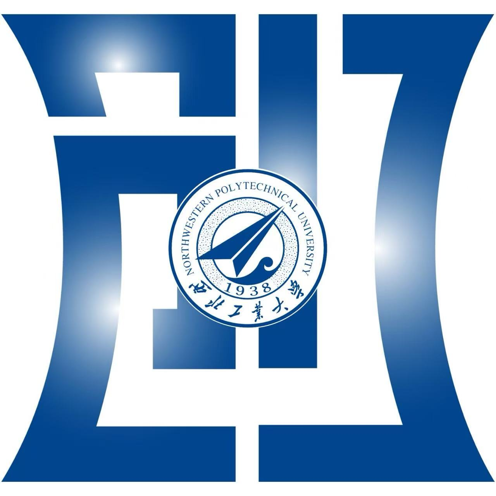

更新日期：

  
  

<!-- markdownlint-disable MD033 MD036 MD041 -->

<h1 align="center">NWPU大学生电子设计竞赛基地备赛资料</h1>

  <strong>一个面向西工大电赛基地同学的开源备赛资料库</strong>

简体中文
· <a href="https://github.com/MDLZCOOL/nwpu-nuedc/issues">反馈问题</a>
· <a href="https://github.com/MDLZCOOL/nwpu-nuedc/pulls">提交贡献</a>

  
  
  
  
  

---

| 目录                   | 备注                                                         |
| ---------------------- | ------------------------------------------------------------ |
| assets                 |                                                              |
| [书籍](./书籍)         | 包含与电赛相关的经典教材、参考书和技术手册的电子版           |
| [历年赛题](./历年赛题) | 历年校赛、联赛、国赛、综合测评题目                           |
| [物品清单](./物品清单) | 待补充                                                       |
| [驱动库](./驱动库)     | 收集并整理了常用MCU、传感器、通信模块的底层驱动代码，方便快速进行原型开发 |

---

## 📖 项目介绍

`nwpu-nuedc` 是西工大电子设计基地为**西北工业大学（NWPU）** 参与**全国大学生电子设计竞赛（NUEDC）** 的同学们维护的一个开源备赛资料库。

本仓库旨在沉淀和分享历年备赛过程中的学习资料、技术方案、代码实现和经验总结，方便后来的同学快速上手，建立知识体系，并在此基础上不断创新。

无论你是刚刚入门的新手，还是经验丰富的老手，都希望你能在这里找到有价值的内容，也欢迎你为此添砖加瓦！

## 🤝 如何贡献

非常欢迎你的加入！你的每一次贡献，无论是添加新的资料、修正一个错字，还是分享你的代码，都能帮助到更多的人。我们推荐通过 **Pull Request** 的方式来贡献你的力量。

贡献流程如下：

1.  **Fork** 本仓库到你自己的 GitHub 账号。
2.  将你 Fork 的仓库 **Clone** 到你的本地。
3.  新建一个分支 (`git checkout -b your-feature-branch`) 并切换到该分支。
4.  在本地进行修改、添加你的资料或代码。
5.  **Commit** 你的更改，并 **Push** 到你远程仓库的对应分支。
6.  在 GitHub 上向本仓库发起一个 **Pull Request**，在 PR 中请清晰地描述你的更改内容和原因。
7.  等待审核合并！我们会在审查后第一时间合并你的贡献。

## ✨ 贡献者

感谢所有为这个项目做出贡献的同学们！

## 📜 许可证

本项目采用 `MIT` 许可证，详情请参阅 [LICENSE.txt](./LICENSE.txt) 文件。

